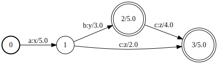
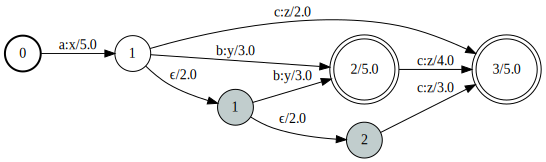

# Creating WFSTs

## Creating a Transducer

The first step is to create a semiring type for the arcs' weight with
the [Semirings.jl](https://gitlab.lisn.upsaclay.fr/fast/semirings.jl)
package. For instance
```
K = LogSemiring{Float64}
```

Then we can create a WFST with the `WFST` function
```julia
WFST(
    semiring = K,
    initweights = [
        (1, K(5))
    ],
    arcs = [
        (1, 3, K(2)),
        (1, 2, K(3)),
        (2, 3, K(4))
    ],
    finalweights = [
        (2, K(5)),
        (3, K(5))
    ],
    statelabels = [
        "a" => "x",
        "b" => "y",
        "c" => "z"
    ],
)
```




The main arguments are:
- `semiring`: the arcs' weight semiring
- `initweights`: a list of arcs `(dest, weight)` leaving the initial state `0`
- `arcs`: a list of arcs `(src, dest, weight)`
- `finalweights` a list of final weights `(state, weight)`
- `statelabels` is an array of labels mapping, e.g. "a" => "x", for
  each state ; labels can be string or integer

!!! info
    In FiniteStateAutomata.jl, we assume by convention that a WFST has
    a unique starting state with identifier 0 and with no incoming arcs
    and that all the incoming arcs to a given state have the same
    label. This latest assumption implicitly associate the labels to
    the states rather than to the arc.

To create an acceptor use single labels instead of mappings, for
instance
```
WFST(
    ...
    statelabels = ["a", "b", "c"],
    ...
)
```

Accepting the empty sequence ϵ requires to allow the automaton to
terminate in the initial state 0, that is to attribute a non-zero final
weight to the intial state. This is achieved by using the argument
`ϵweight = one(K)` in `WFST`.

## Representing ϵ arcs
So far we have only considered ϵ-free WFST, that is WFST with no ϵ
transition. FiniteStateAutomata.jl has a special way to represent such
arcs. Internally, it represents the WFST (excluding the initial state)
as a matrix with the following decomposition:
```math
\mathbf{T} = \mathbf{S} + \mathbf{U}\mathbf{E}^*\mathbf{V}.
```
``\mathbf{S}`` is ``Q \times Q`` square matrix where ``Q`` is the
number of states (not including the initial state). Each non-zero
element in ``\mathbf{S}`` corresponds to the weight of an arc with
non-ϵ label. The right-and-side term corresponds to additional arcs
that can be compressed by being represented by a low-rank factorize
matrix. ``\mathbf{U}`` is a ``Q \times P`` matrix, ``\mathbf{E}`` is
a ``P \times P`` matrix and ``\mathbf{V}`` is a ``P \times Q`` matrix
where ``P`` is the numbers low-rank *factors*. Finally, the ``^*``
operator denotes the matrix power series
```math
\mathbf{E}^* = \mathbf{E}^0 + \mathbf{E}^1 + \mathbf{E}^2 + \dots
```
We interpret these "factors" as ϵ-state, i.e. states for which each
incoming arc has an ϵ label. Following this rationale, ``\mathbf{U}``
represents the arcs leaving regular states to ϵ-states, ``\mathbf{E}``
represents transition between ϵ-states and ``\mathbf{V}`` represents
the arcs leaving ϵ-states to regular states. A WFST with factors
can be created by providing the arguments `infactors` (``\mathcal{U}``),
`factors` (``\mathbf{E}``) and `outfactors` (``\mathbf{V}``)
```julia
WFST(
    semiring = K,
    initweights = [
        (1, K(5))
    ],
    arcs = [
        (1, 3, K(2)),
        (1, 2, K(3)),
        (2, 3, K(4))
    ],
    finalweights = [
        (2, K(5)),
        (3, K(5))
    ],
    statelabels = [
        "a" => "x",
        "b" => "y",
        "c" => "z"
    ],
    infactors = [
        (1, 1, K(2))
    ],
    outfactors = [
        (1, 2, K(3)),
        (2, 3, K(3))
    ],
    factors = [
        (1, 2, K(2))
    ]
)
```



